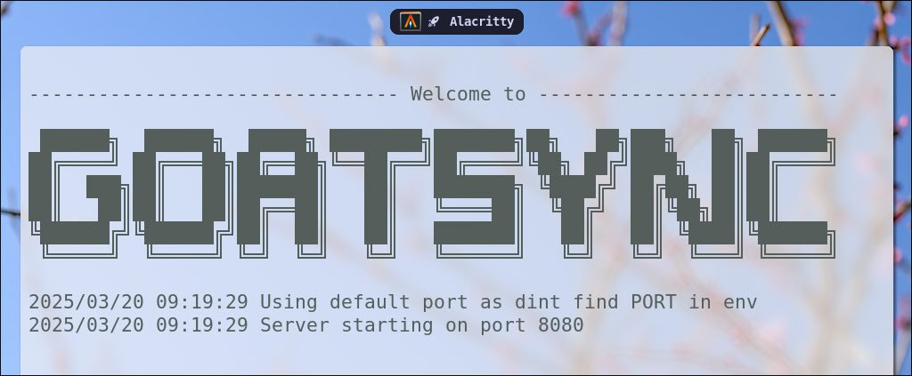

# 🔄 GoatSync
GoatSync is a GoLang port of the EteSync server, aiming to provide an open-source, end-to-end encrypted synchronization solution for contacts, calendars, and tasks.
The project seeks to maintain the same level of data privacy and security as the original EteSync, while leveraging the performance and concurrency features of the Go programming language.

> This project is in early phase of it's life and may not be stable. Please have backup of your data.

## 📖 Table of Contents

- [✨ Features](#features)
- [🚀 Installation](#installation)
- [🛠️ Usage](#usage)
- [🗑️ Uninstall](#uninstall)
- [🐛 Bugs or Requests](#bugs-or-requests)
- [🤝 Contributing](#contributing)
- [📄 License](#license)
- [🙏 Acknowledgments](#acknowledgments)

## ✨ Features

* End-to-end encryption for secure data synchronization
* Support for contacts, calendars, and tasks
* Self-hosted server for maximum control over user data
* Designed with performance and concurrency in mind, utilizing GoLang's capabilities
* Open-source and community-driven development

## 🚀 Installation

To install GoatSync, follow these steps:
* Clone the repository using `git clone https://github.com/jollySleeper/goatsync.git`
* Navigate to the project directory using `cd goatsync`
* Build the project using `go build main.go`
* Run the server using `./goatsync`
* Docker Guide dropping soon.

## 🛠️ Usage

* Configure the server by editing the `.env` file. Take a look at sample `local.env` file.
* Use the provided API endpoints to interact with the server (API documentation will be provided separately).
* Integrate GoatSync with your favorite calendar, contacts, and tasks applications which are supported by EteSync.

## 🗑️ Uninstall

If you decide to uninstall, we're sorry to hear that `goatsync` didn't meet your expectations. We appreciate your feedback. 
To uninstall GoatSync, simply delete the project directory and any associated configuration files.

## 🐛 Bugs or Requests

If you encounter any problem(s) feel free to open an [issue](https://github.com/jollySleeper/goatsync/issues/new).
If you feel the project is missing a feature, please raise an [issue](https://github.com/jollySleeper/goatsync/issues/new) with `FeatureRequest` as heading.

## 🤝 Contributing

Contributions are welcome! Please follow these steps:

1. Fork the repository.
2. Create a new branch (`git checkout -b feature/YourFeature`).
3. Make your changes and commit them (`git commit -m 'Add some feature'`).
4. Push to the branch (`git push origin feature/YourFeature`).
5. Open a pull request.

## 📄 License

This project is licensed under the MIT License - see the [LICENSE](https://github.com/jollySleeper/goatsync/blob/main/LICENSE) file for details.

## 🙏 Acknowledgments

GoatSync is heavily inspired by the [EteSync](https://github.com/etesync) project and its contributors.
We thank them for their work and dedication to creating a secure and private synchronization solution.
